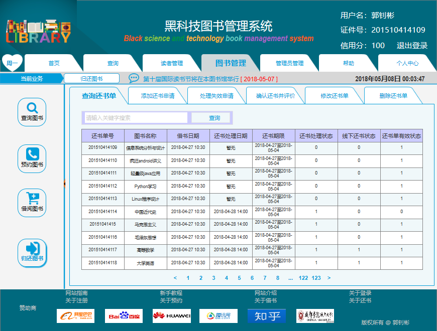

# 实验5：图书管理系统数据库设计与界面设计
|学号|班级|姓名|
|:-------:|:-------------: | :----------:|
|201510414109|软件(本)15-1|郭钊彬|


## 1.数据库表设计Persistent_store

## 1.1. 书籍永久的存储（Persistent_store）表
|字段|类型|主键，外键|可以为空|默认值|约束|说明|
|:-------:|:-------------:|:------:|:----:|:---:|:----:|:-----|
|persistent_ID|varchar2(100)|主键|否|||书籍永久存储ID|

```
说明：
书籍永久的存储表：在数据库中的存储数据，其他对与书籍有关的活动都要使用其存储表
```

## 1.2. 书目（Books）表
|字段|类型|主键，外键|可以为空|默认值|约束|说明|
|:-------:|:-------------:|:------:|:----:|:---:|:----:|:-----|
|books_id|varchar2(100)|主键|否|||书目编号|
|persistent_ID|varchar2(100)|外键|否|||书目的书籍永久存储ID，Persistent_store表的主键|
|books_label|varchar2(100)| |是|||书目类别|
|books_name|varchar2(100)| |否|||图书名称|
|books_stock|int(100)| |否|||库存|
|books_number|int(100)| |否|||总量|

```
说明：
书目表：图书目录，字段包括图书的主要信息，如标签、书名、库存等
```

## 1.3. 图书（Item）表
|字段|类型|主键，外键|可以为空|默认值|约束|说明|
|:-------:|:-------------:|:------:|:----:|:---:|:----:|:-----|
|ISBN|varchar2(100)|主键|否|||ISBN|
|persistent_ID|varchar2(100)|外键|否|||书目的书籍永久存储ID，Persistent_store表的主键|
|Label|varchar2(100)| |是|||图书类别|
|Name|varchar2(100)| |否|||图书名称|
|Author|varchar2(100)| |否|||作者|
|Publisher|varchar2(100)| |否|||出版社|
|Price|float(100)| |否|||价格|
|Info|varchar2(100)| |是|||描述|
|Stock|int(100)| |否|||库存|
|Number|int(100)| |否|||总量|
***

```
说明：
图书表：字段包括图书的详细信息，如ISBN、标签、书名、作者、出版社、价格、库存等
```

## 1.4. 用户（User）表
|字段|类型|主键，外键|可以为空|默认值|约束|说明|
|:-------:|:-------------:|:------:|:----:|:---:|:----:|:-----|
|user_ID|varchar2(100)|主键|否|||用户id|
|userName|varchar2(100)| |否|||用户名|
|userPassword|varchar2(100)| |否|||密码|
|Name|varchar2(100)| |是|||姓名|
|sex|varchar2(10)| |是|||性别|
|phoneNumber|int(100)| |是|||电话号码|
|email|varchar2(100)| |是|||email|
|reader_Address|varchar2(100)| |是|||地址|
|validDocuments|varchar2(100)| |是|||有效证件|
***

```
说明：
1.字段包括用户基本信息：账户、密码、姓名、性别等
2.安全信息：有效证件、信用积分等
3.注意userName和Name字段的区别
```

## 1.5. 读者（Reader）表
|字段|类型|主键，外键|可以为空|默认值|约束|说明|
|:-------:|:-------------:|:------:|:----:|:---:|:----:|:-----|
|reader_ID|varchar2(100)|主键|否|||读者id|
|user_ID|varchar2(100)|外键|否|||读者的用户ID，USER表的主键|
|userCategory|varchar2(100)| |否|||用户类别|
|creditScore|float(100)| |否|||信用积分|
|reservationBook|varchar2(100)|外键|是|||预约图书汇总，以逗号分开|
|borrowBook|varchar2(100)|外键|是|||借阅图书汇总，以逗号分开|
***

```
说明：
1.读者基本信息（如账户、密码、姓名等）不再设计，而是设置USER表的外键user_ID关联
2.增加安全信息：有效证件、信用积分等
3.增加操作信息：预定书籍、租借书籍等
```

## 1.6. 图书管理员（Librarian）表
|字段|类型|主键，外键|可以为空|默认值|约束|说明|
|:-------:|:-------------:|:------:|:----:|:---:|:----:|:-----|
|librarianID|varchar2(100)|主键|否|||图书管理员编号|
|user_ID|varchar2(100)|外键|否|||图书管理员的用户ID，USER表的主键|
|scopeOfWork|varchar2(100)| |否|||工作范围|
|tenureTime|varchar2(100)| |否|||任职时间|
|workShift|varchar2(100)| |否|||上班时间|
|processingNumber|int(100)| |是|||处理订单数|
***

```
说明：
1.图书管理员基本信息（如账户、密码、姓名等）不再设计，而是设置USER表的外键user_ID关联
2.增加管理信息：工作范围、任职时间、上班时间、处理订单数等
```

## 1.7. 超级管理员（Administrator）表
|字段|类型|主键，外键|可以为空|默认值|约束|说明|
|:-------:|:-------------:|:------:|:----:|:---:|:----:|:-----|
|adminID|varchar2(100)|主键|否|||超级管理员编号|
|user_ID|varchar2(100)|外键|否|||超级管理员的用户ID，USER表的主键|
|scopeOfWork|varchar2(100)| |否|||工作范围|
|tenureTime|varchar2(100)| |否|||任职时间|
***

```
说明：
增加管理信息：工作范围、任职时间等
```

## 1.8. 预订书单（Reservation）表
|字段|类型|主键，外键|可以为空|默认值|约束|说明|
|:-------:|:-------------:|:------:|:----:|:---:|:----:|:-----|
|reservation_ID|varchar2(100)|主键|否|||预约单号|
|reader_ID|varchar2(100)|联合主键1，\n外键|否|||读者编号，Reader表的主键|
|ISBN|varchar2(100)|联合主键2，\n外键|否|||读者预约的图书的ISBN，Item表的主键|
|librarianID|varchar2(100)|外键|是|||处理该预订书单的图书管理员ID，Librarian表的主键|
|reservation_book|varchar2(10)| |否|||预约书籍|
|reservation_Date|varchar2(10)| |否|||预约日期|
|status|int(10)| |否|||预约状态|
|stock|int(100)| |否|||剩余数量|
|number|int(100)| |否|||预约数量|
***

```
说明：
1.预订书单涉及读者、图书管理员和图书，因此需要设计外键字段
2.解释字段图书管理员librarianID值“可以为空！”的原因：
  因为读者初次预订时，不需图书管理员操作，故librarianID为空；
  当图书管理员处理预订书单以后，录入librarianID，更新预订书单。
```

## 1.7. 借书单（Borrow）表
|字段|类型|主键，外键|可以为空|默认值|约束|说明|
|:-------:|:-------------:|:------:|:----:|:---:|:----:|:-----|
|borrow_ID|varchar2(100)|主键|否|||借书单号|
|reader_ID|varchar2(100)|联合主键1，\n外键|否|||读者编号，Reader表的主键|
|ISBN|varchar2(100)|联合主键2，\n外键|否|||读者借阅图书的ISBN，Item表的主键|
|reservation_ID|varchar2(100)|联合主键3，\n外键|否|||读者预订书单的编号，Reservation表的主键|
|librarianID|varchar2(100)|外键|是|||线上处理该借书单的图书管理员ID，Librarian表的主键|
|librarianID_take|varchar2(100)|外键|否|||线下领书处理管理员ID，Librarian表的主键|
|borrow_book|varchar2(10)| |否|||书籍信息|
|reservation_Date|varchar2(10)| |否|||预约日期|
|borrow_Date|varchar2(10)| |否|||借书日期|
|take_Term|varchar2(10)| |是|||领书期限|
|take_Date|varchar2(10)| |是|||线下领书日期|
|return_Term|varchar2(10)| |是|||还书期限|
|status_Borrow|int(10)| |否|||借书状态|
|status_Take|int(10)| |否|||领书状态|
|effective|int(10)| |否|||借书单有效状态|
***

```
说明：
1.借书单表字段数据基本来自预约书单表，故设置外键reservation_ID与Reservation表关联
2.管理员ID有两个是因为线上处理借书单的管理员和读者去线下图书馆领书时的管理员可能不同
3.增加领书期限、领书状态和线下领书日期是因为：
  因为读者借书申请后，借书状态和领书状态都为0，图书管理员处理以后，借书状态变为1，更新借书单；
  当读者去图书馆领到书以后，领书状态变为1，更新借书单。
4.解释字段领书期限take_Term和具体领书日期take_Date值“可以为空！”的原因：
  借书单生成时，不需图书管理员操作，故take_Term和take_Date为空；
  当图书管理员处理借书操作后，录入take_Term，更新借书单；
  当读者领书成功，录入take_Date，更新借书单。
5.设置借书单有效状态（effective）字段目的：
  读者申请借书但未在规定时间内到图书馆领书，此借书单失效
```

## 1.8. 还书单（Return）表
|字段|类型|主键，外键|可以为空|默认值|约束|说明|
|:-------:|:-------------:|:------:|:----:|:---:|:----:|:-----|
|return_ID|varchar2(100)|主键|否|||还书单号|
|reader_ID|varchar2(100)|联合主键1，\n外键|否|||读者编号，Reader表的主键|
|ISBN|varchar2(100)|联合主键2，\n外键|否|||读者返还图书的ISBN，Item表的主键|
|borrow_ID|varchar2(100)|联合主键3，\n外键|否|||读者借书单的编号，Borrow表的主键|
|librarianID|varchar2(100)|外键|是|||线上处理该还书单的图书管理员ID，Librarian表的主键|
|librarianID_take|varchar2(100)|外键|否|||线下领书处理管理员ID，Librarian表的主键|
|return_book|varchar2(10)| |否|||书籍信息|
|reservation_Date|varchar2(10)| |否|||预约日期|
|borrow_Date|varchar2(10)| |否|||借书日期|
|return_Date|varchar2(10)| |否|||还书处理日期|
|take_Term|varchar2(10)| |是|||还书期限|
|take_Date|varchar2(10)| |是|||线下还书日期|
|status_1|int(10)| |否|||还书处理状态|
|status_2|int(10)| |否|||线下还书状态|
|effective|int(10)| |否|||还书单有效状态|
***

```
说明：
1.借书单表字段数据基本来自还书单表，故设置外键reservation_ID与Reservation表关联
2.增加预约日期、借书日期和还书处理日期让读者可以清晰了解到这本书从预约到还书的具体时间
```

## 2. 界面设计
## 2.1. 还书界面设计 https://1ng99u.axshare.com/index.html

- 用例图参见：还书用例
- 类图参见：领域层的读者类、图书管理员类、还书类
- 顺序图参见：还书顺序图
- API接口如下：
（说明：不用读者增加还书单，读者已经领书，并且图书管理员处理借书单后，自动生成还书单。因此不再设计“增加还书单”API）

1.查询还书单

- 功能：查询还书单，用于获取全部还书单信息
- 请求地址： http://api.library.com/v1/api/query_return
- 请求方法：GET
- 请求参数：

|参数名称|必填|说明|
|:-------:|:-------------: | :----------:|
|user_ID|是|用户登录状态凭证 |
|access_token|是|用于验证请求合法性的认证信息 |
|method|是|固定为 “GET”|

- 返回实例：
```
{
    "info": "你的还书单列表",
    "total": 1024,
    "data": [
        {
        "return_ID": "xxxx-xxxx-xxx-xxx",
        "return_book": "信息系统分析与设计",
        "borrow_Date": "2018-04-27 10:30",
        "return_Date": "暂无",
        "take_Term": "2018-04-27至2018-05-04",
        "status_1": "0",
        "status_2": "0",
        "effective": "1",
        "path": "http://api.library.com/v1/api/query_return/return_ID/return_list",
        },
        {
        ...其他还书单
        }
    ]
    "code": 200
}
```
- 返回参数说明：
    
|参数名称|说明|
|:-------:|:-------------: |
|Info|返回的提示信息|
|total|返回还书单数量|
|data|返回还书单列表内容数据主体<br>"return_ID":还书单号<br>"return_book": "书名"<br>"borrow_Date": "借书日期"<br>"return_Date": "还书处理日期"<br>"take_Term": "还书期限：提交还书申请后一周内"<br>"status_1": "还书处理状态：1表示已处理，0表示未处理"<br>"status_2": "线下还书状态：1表示已还书至图书馆，0表示未还书到图书馆"<br>"effective": "还书单有效状态：1表示有效，0表示无效"<br>"path": "还书单详情链接地址"|
|code|返回码|

2. 添加还书申请
- 功能：用于提交还书申请
- 请求地址： http://api.library.com/v1/api/apply_return
- 请求方法：POST
- 请求参数：

|参数名称|必填|说明|
|:-------:|:-------------: | :----------:|
|user_ID|是|用户登录状态凭证 |
|access_token|是|用于验证请求合法性的认证信息 |
|method|是|固定为 “POST”|
|return_ID|是|还书单号 |

- 返回实例：
```
{
    "info": "已更新还书单，请等待图书管理员处理还书申请",
    "data": {
        "return_ID": "2018-0427-1024-01",
        "user_ID": "2015-1041-41-09",
        "librarianID_borrow": "暂无",
        "librarianID_take": "暂无",
        "ISBN": "978-7-302-32982-4",
        "return_book": "信息系统分析与设计",
        "reservation_Date": "2018-04-09 15:36",
        "borrow_Date": "2018-04-27 10:30",
        "return_Date": "2018-04-27 14:00",
        "take_Term": "2018-04-27至2018-05-04",
        "take_Date": "暂无",
        "status_1": "0",
        "status_2": "0",
        "effective": "1",
    },
    "code": 200
}
```
- 返回参数说明：
    
|参数名称|说明|
|:-------:|:-------------: |
|Info|返回的提示信息|
|data|返回需还书的详情数据主体<br>"return_ID":还书单号<br>"user_ID": "用户id"<br>"librarianID_borrow": "线上图书管理员ID"<br>"librarianID_take": "还书处理管理员ID"<br>"ISBN": "ISBN"<br>"return_book": "书名"<br>"reservation_Date":"预约日期"<br>"borrow_Date": "借书日期"<br>"return_Date": "还书处理日期"<br>"take_Term": "还书期限：提交还书申请后一周内"<br>"take_Date":"线下还书日期"<br>"status_1": "还书处理状态：1表示已处理，0表示未处理"<br>"status_2": "线下还书状态：1表示已还书至图书馆，0表示未还书到图书馆"<br>"effective": "还书单有效状态：1表示有效，0表示无效"<br>"path": "还书单详情链接地址"|
|code|返回码|

3. 处理失效申请
- 功能：用于提交处理还书单失效申请
- 请求地址： http://api.library.com/v1/api/effective_return
- 请求方法：POST
- 请求参数：

|参数名称|必填|说明|
|:-------:|:-------------: | :----------:|
|user_ID|是|用户登录状态凭证 |
|access_token|是|用于验证请求合法性的认证信息 |
|method|是|固定为 “POST”|
|return_ID|是|还书单号 |
|effective|是|还书单失效原因 |
|manage|是|处理类型：1.逾期交钱；2.损坏交钱；3.遗失交钱；4.遗失购买新书还书等 |

- 返回实例：
```
{
    "info": "已提交处理还书单失效申请，请等待图书管理员处理",
    "data": {
        "return_ID": "2018-0427-1024-01",
        "return_book": "信息系统分析与设计",
        "effective": "逾期",
        "manage": "1.逾期交钱",
    },
    "code": 200
}
```
- 返回参数说明：
    
|参数名称|说明|
|:-------:|:-------------: |
|Info|返回的提示信息|
|data|返回处理失效申请主要数据主体<br>"return_ID":还书单号<br>"return_book": "书名"<br>"effective":"还书单失效原因"<br>"manage": "处理类型：1.逾期交钱；2.损坏交钱；3.遗失交钱；4.遗失购买新书还书等"|
|code|返回码|

4. 确认还书并评价
- 功能：读者到图书馆还书，图书管理员检查无误后，用于读者确认线下还书并评价
- 请求地址： http://api.library.com/v1/api/support
- 请求方法：POST
- 请求参数：

|参数名称|必填|说明|
|:-------:|:-------------: | :----------:|
|user_ID|是|用户登录状态凭证 |
|access_token|是|用于验证请求合法性的认证信息 |
|method|是|固定为 “POST”|
|starLevel|是|评价星级（几星） |
|content|否|评价内容 |

- 返回实例：
```
{
    "info": "感谢评价",
    "code": 200
}
```
- 返回参数说明：
    
|参数名称|说明|
|:-------:|:-------------: |
|Info|返回的提示信息|
|code|返回码|

5. 修改还书单（延期还书）
- 功能：用于读者延期还书
- 请求地址： http://api.library.com/v1/api/modify
- 请求方法：PUT
- 请求参数：

|参数名称|必填|说明|
|:-------:|:-------------: | :----------:|
|user_ID|是|用户登录状态凭证 |
|access_token|是|用于验证请求合法性的认证信息 |
|method|是|固定为 “PUT”|
|action|是|操作的类型：值为change |
|takeTerm|是|还书期限：在一定范围内选择 |

- 返回实例：
```
{
    "info": "修改成功",
    "code": 200
}
```
- 返回参数说明：
    
|参数名称|说明|
|:-------:|:-------------: |
|Info|返回的提示信息|
|code|返回码|

6. 删除还书单（只能删除已还书的还书单）
- 功能：用于读者删除已还书的还书单
- 请求地址： http://api.library.com/v1/api/delete
- 请求方法：DELETE
- 请求参数：

|参数名称|必填|说明|
|:-------:|:-------------: | :----------:|
|user_ID|是|用户登录状态凭证 |
|access_token|是|用于验证请求合法性的认证信息 |
|method|是|固定为 “DELETE”|

- 返回实例：
```
{
    "info": "删除成功",
    "code": 200
}
```
- 返回参数说明：
    
|参数名称|说明|
|:-------:|:-------------: |
|Info|返回的提示信息|
|code|返回码|

