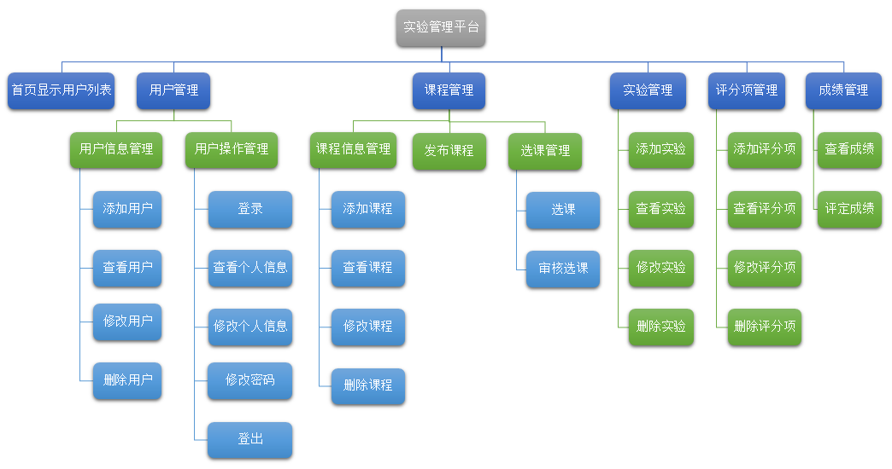
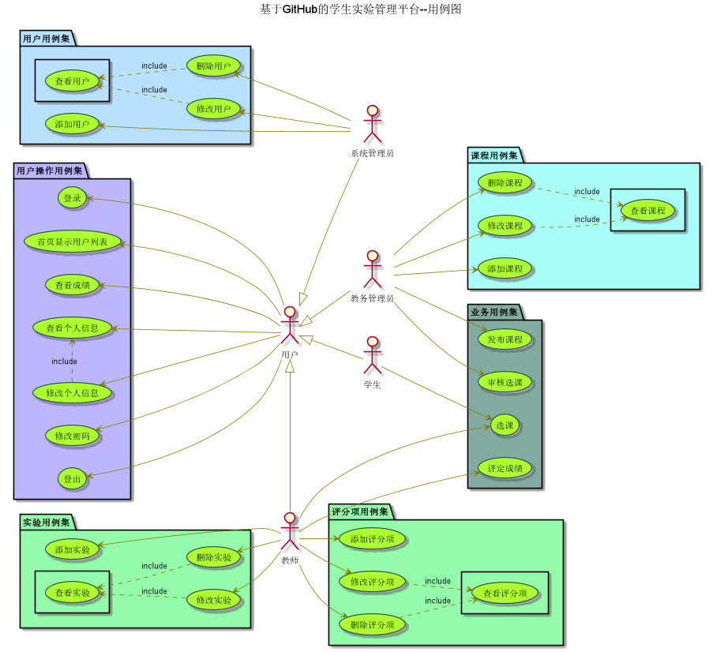
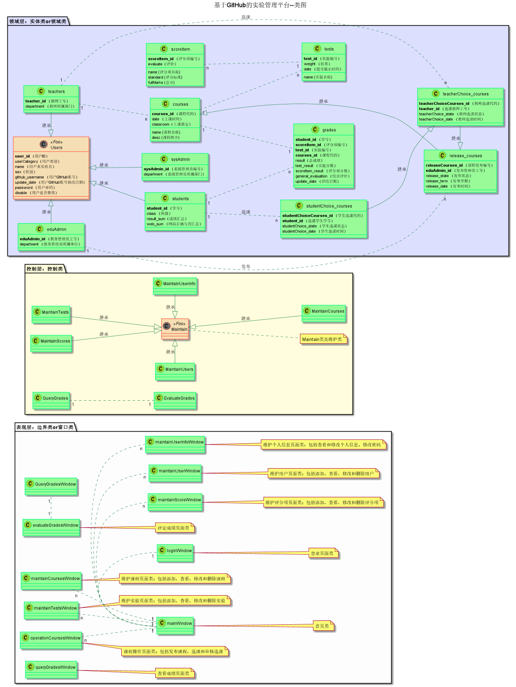

# 基于GitHub的实验管理平台的分析与设计

### 成都大学信息科学与工程学院

|学号|班级|姓名|
|:-------:|:-------------: | :----------:|
|201510414109|软件(本)15-1|郭钊彬|

## 1. 概述
- 作用：在线管理实验成绩的Web应用系统。学生和老师的实验内容均存放在GitHUB页面上。
- 学生的功能主要有：
  - 管理个人信息，即查看和维护自己的GitHub用户名和密码，学生的GitHub用户名是公开的。
  - 选择课程，可以选择多门课程，但不能超过限定范围，并且只能选择已经老师选择的课程。
  - 查询成绩，成绩不公开，每个学生只能查询自己选择的课程的实验成绩。
- 老师的功能主要有：
  - 选择课程，可以选择多门课程，但不能超过限定范围，并且只能老师先选，学生后选。
  - 评定成绩，只能维护老师自己的课程及成绩。
  - 查询成绩，可以查看老师自己的课程的所有学生的成绩。
  - 管理评分项，即对评分项的增删改查操作，包括制定评分标准和分数等。
  - 管理实验，即对老师自己课程的实验的增删改查操作，包括设置标题和权重等。
- 教务管理员的功能主要有：
  - 管理课程，即课程的增删改查操作，包含课程代码、名称、类别、介绍、学分、学时、修读学期和起始结束周等。
  - 发布课程，设置完课程以后便可发布该学期的课程。
  - 管理选课，用于审核课程是否可以开课，即如果有的课程选课学生人数太少，则取消该课程开课。
  - 查询成绩，可以查看所有学生的课程成绩。
- 系统管理员的功能主要有：
  - 管理用户，对用户中的学生、教师和教务管理员信息的录入、修改、查找和删除。
- 课程实验设计要求：（四多）
  - 多评分项实验，即每个实验的实验成绩细分为多个评分项，每个评分项对应各自的评分标准。
  - 多个实验设计，即每个课程的知识考核细分为多个实验，每个实验包含各自的实验名称、总成绩、评语和权重。
  - 多门课程设计，即每个学期的教学安排由多门课程组成，每门课程包含各自的名称、选课老师、学生、实验和加权平均分。
  - 多个学期设计，即每个学校的学生培养时间由多个学期组成，每个学期安排对应课程。
- 批改实验设计要求：
  - 实验成绩按数字分数计算，每项实验的分数等于其所有评分项的分数之和，满分为100分，最低为0分。
  - 批改实验时，对每个评分项进行评分，系统自动计算出所有评分项的成绩之和为该实验的总成绩。
  - 每项实验的权重按百分比计算，所有实验的权重总和为1。
  - 结算时，每门课程的总成绩由系统自动计算每个学生的所有实验的加权平均分得出（即课程总成绩=加权平均分）。
  - 评价规则，即每个评分项输入对应的评价，所有评分项评价汇总为实验评价，所有实验评价汇总为课程评价。
  - 老师和学生都能通过本系统的链接方便地跳转到学生的每个GitHUB实验目录，以便批改实验或者查看实验情况。
    
## 2. 系统总体结构

界面设计参见：https://zwdbox.github.io/is_analysis/test6/ui/index.html

## 3. 用例图设计 [源码](src/UseCase.puml)
- 说明：用例图中，最容易混淆的就是《include》和《extend》的用法。如何区分呢？如下说明：
  - 《Include》: 表示一个用例包含另一个用例，即要完成包含用例就一定要执行被包含用例。
  - 《extend》:表示一个用例扩展到另一个用例，这里有一点需要注意：在执行一个被扩展用例时，不一定执行扩展用例。即扩展用例的执行是受条件限制的，是可选的。这一点，是区别两个用例之间的关系是《包含》还是《扩展》的依据。
  - 搞不太清楚的可以点击此链接了解详情：https://blog.csdn.net/xiao190128/article/details/50808770

## 4. 类图设计 [源码](src/class.puml)

## 5. 数据库设计
- ### [参见数据库设计](./数据库设计.md)

## 6. 用例及界面详细设计
- ### [“学生列表”用例](./用例/学生列表.md),[界面](https://zwdbox.github.io/is_analysis/test6/ui/index.html)
- ### [“评定成绩”用例](./用例/评定成绩.md),[界面](https://zwdbox.github.io/is_analysis/test6/ui/评定成绩.html)
- ### [“查看成绩”用例](./用例/查看成绩.md),[界面](https://zwdbox.github.io/is_analysis/test6/ui/查看成绩.html)
- ### [“修改密码”用例](./用例/修改密码.md),[界面](https://zwdbox.github.io/is_analysis/test6/ui/顶部菜单.html)
- ### [“修改用户信息”用例](./用例/修改用户信息.md),[界面](https://zwdbox.github.io/is_analysis/test6/ui/顶部菜单.html)
- ### [“查看用户信息”用例](./用例/查看用户信息.md),[界面](https://zwdbox.github.io/is_analysis/test6/ui/顶部菜单.html)
- ### [“登出”用例](./用例/登出.md),[界面](https://zwdbox.github.io/is_analysis/test6/ui/顶部菜单.html)
- ### [“登录”用例](./用例/登录.md),[界面](https://zwdbox.github.io/is_analysis/test6/ui/登录.html)

## 7. 参考文献
- 绘制方法参考[PlantUML标准](http://plantuml.com)
- Markdown格式参考：https://www.jianshu.com/p/b03a8d7b1719